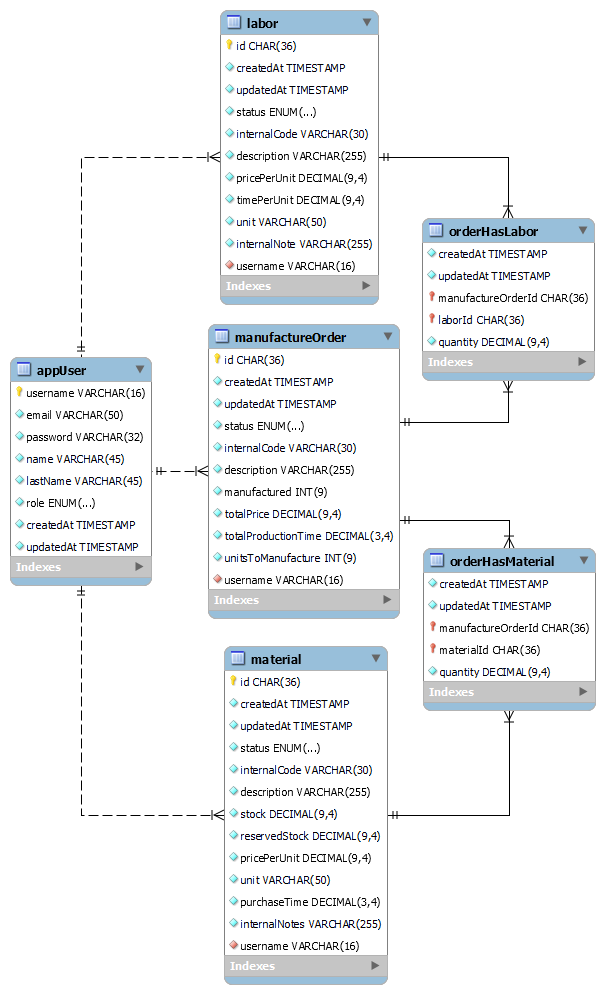

# Custom Furniture Manufacturing API

a

The `Custom Furniture Manufacturing API System` provides an interface for integrating a bespoke ordering and manufacturing system into your business infrastructure.

This API **streamlines the process** for estimating production time, materials cost, labor cost and order progress tracking.

## Table of content

- [Key features](#key-features)
- [API endpoints](#api-endpoints)
  - [authentication operations](#authentication-authentication-operations)
  - [inventory operations](#inventory-inventory-operations)
  - [labor operations](#labor-labor-operations)
  - [orders operations](#orders-orders-operations)
- [API models](#api-models)
- [Data base overview](#data-base-overview)
- [Installation](#installation)
- [Known issues](#known-issues)

## Key features

<details>
  <summary>Click here</summary>

- **Time estimation:** estimates an order production time based into;

- materials purchasing time
- production time for each manufacturing step

- **Cost calculation:** calculates an order cost based in;

  - materials using predefined material costs
  - labor using predefined cost structures

- **Progress tracking:** provide an order status based in:

  - actual manufactured units

- **Order management:**

  - provides information of all or individual orders
  - allows order cancellation or modification

- **Inventory management:**

  - manages inventory of materials and their associated cost and purchasing time
  - automatically adjust inventory when materials are used or reserved for an order
  - automatically adjust inventory when order is updated

- **Manufacturing order placement:** accept and validates custom order placement based on;

  - material availability
  - pre existing labor structures
  - total production time

- **Labor structure management:** manages labor structured cost based on:

  - labor time
  - labor cost
  </details>

## API endpoints

### **`authentication`** authentication operations

<details>
  <summary>Click here</summary>

 **`POST`** `/api/v1/auth/login` Login the user.

<details>
  <summary>Click here</summary>

Server side create OAuth 2.0 tokens, stores them in DB and return them.

- **Request**

  ```
  // Example

  // Header
  Content-Type: application/x-www-form-urlencoded

  // Body
  client_id=juan&client_secret=5678910

  ```

- **Responses**

  - 201 OK. Response with a **access_token**, **refresh_token** and **expires_in** (expiration time of access_token in seconds). Tokens must be stored by client.

  ```
  // Example

  // Header
  HTTP/1.1 200 OK
  Content-Type: application/json; charset=utf-8

  // Body
  {
    "access_token": "1ad67c7c-785d-4968-b34d-2d77d5802bbf",
    "refresh_token": "d4917ddd-11bb-404b-ac6d-a3123de3e24c",
    "expires_in": 60
  }
  ```

  - 400 Bad Request. (Missing argument). Response body with a JSON informative message.

  - 404 Not Found. (Invalid credentials). Response body with a JSON informative message.

  - 500 Internal Server Error. Response body with a JSON informative message.

</details>

 **`DELETE`** `/api/v1/auth/logout` Logout the user.

<details>
  <summary>Click here</summary>

Server side delete the OAuth 2.0 tokens from the DB.

- **Request**

  ```
  // Example

  // Header
  authorization: c326b621-167f-4192-9845-b11cc01597fb // Valid token
  ```

- **Responses**

  - 204 No Content. (Successful logout).

  - 400 Bad Request. (Missing authentication token). Response body with a JSON informative message.

  - 401 Unauthorized. (Invalid authentication token). Response body with a JSON informative message.

  - 500 Internal Server Error. Response body with a JSON informative message.

</details>

 **`POST`** `/api/v1/auth/refresh-tokens` Refresh the OAuth 2.0 tokens.

<details>
  <summary>Click here</summary>

Server side generates a new token and a new refresh token, update the old ones in the DB side and response with the new tokens.

- **Request**

  ```
  // Example

  // Header
  Content-Type: application/x-www-form-urlencoded

  // Body
  refresh_token=1ea0e31e-2fc8-429b-9038-827f35e42dc3
  ```

- **Responses**

  - 200 OK. Response with a **new token** and a **new refresh token**. Tokens must be stored by client.

  ```
  // Example

  // Header
  HTTP/1.1 200 OK
  Content-Type: application/json; charset=utf-8

  // Body
  {
    "access_token": "add11a75-3dfa-4f76-888e-967a1a1a738a",
    "refresh_token": "51b27992-2043-4233-9dc9-56c31086688d",
    "expires_in": 60
  }
  ```

  - 400 Bad Request. (Missing authentication token). Response body with a JSON informative message.

  - 401 Unauthorized. (Invalid authentication token). Response body with a JSON informative message.

  - 500 Internal Server Error. Response body with a JSON informative message.

</details>

</details>

### **`user`** user operations

<details>
  <summary>Click here</summary>

 **`POST`** `/api/v1/user` Create a new user.

<details>
  <summary>Click here</summary>

Server side creates a new user and stores it into data base.

- **Request**

  ```
  // Example

  // Header
  Content-Type: application/json
  Authorization: 214985e1-45d4-4698-8e28-22741ff5a631

  // Body
  {
    "username": "superSystem",
    "email": "bespokeSystems@gmail.com",
    "password": "secret",
    "name": "John",
    "lastName": "Doe",
    "role": "sales"
  }
  ```

- **Responses**

  - 201 Created. The user has been created and stored in DB. Response with resource with out password field.

  ```
  // Example

  // Header
  Content-Type: application/json

  // Body
  {
    "createdAt": "2023-11-02T18:16:52.151Z",
    "updatedAt": "2023-11-02T18:16:52.151Z",
    "username": "superSystem",
    "email": "bespokeSystems@gmail.com",
    "name": "John",
    "lastName": "Doe",
    "role": "sales",
    "hashedPassword": "*",
    "salt": "*"
  }
  ```

  - 401 Unauthorized. (Invalid authentication token). Response body with a JSON informative message.
  - 404 Not Found. (The material does not exist).
  - 500 Internal Server Error. Response body with a JSON informative message.

</details>

 **`GET`** `/api/v1/user/{username}` Returns a user by username.

<details>
  <summary>Click here</summary>

Returns a user by username stored in the DB.

- **Responses**

  - 200 OK. Password is not returned.

  ```
  // Example

  // Header
  Content-Type: application/json

  // Body
  {
    "createdAt": "2023-11-02T18:16:52.151Z",
    "updatedAt": "2023-11-02T18:16:52.151Z",
    "username": "superSystem",
    "email": "bespokeSystems@gmail.com",
    "name": "John",
    "lastName": "Doe",
    "role": "sales",
    "hashedPassword": "*",
    "salt": "*"
  }
  ```

  - 400 Bad Request. Response body with a JSON informative message.
  - 401 Unauthorized. (Invalid authentication token). Response body with a JSON informative message.
  - 500 Internal Server Error. Response body with a JSON informative message.

</details>

 **`GET`** `/api/v1/user` Returns all users.

<details>
  <summary>Click here</summary>

Returns all users stored in the DB.

- **Responses**

  - 200 OK. Passwords are not returned.

  ```
  // Example

  // Header
  Content-Type: application/json

  // Body
  [
    {
        "username": "admin",
        "email": "admin@system.com",
        "hashedPassword": "*",
        "salt": "*",
        "name": "adminName",
        "lastName": "adminLastName",
        "role": "admin",
        "createdAt": "2023-11-02T17:58:30.812Z",
        "updatedAt": "2023-11-02T17:58:30.812Z"
    },
    {
        "username": "superSystem",
        "email": "bespokeSystems@gmail.com",
        "hashedPassword": "*",
        "salt": "*",
        "name": "John",
        "lastName": "Doe",
        "role": "sales",
        "createdAt": "2023-11-02T18:16:52.151Z",
        "updatedAt": "2023-11-02T18:16:52.151Z"
    }
  ]
  ```

  - 401 Unauthorized. (Invalid authentication token). Response body with a JSON informative message.
  - 500 Internal Server Error. Response body with a JSON informative message.

</details>

 **`PATCH`** `/api/v1/user/{username}` Update a new user.

<details>
  <summary>Click here</summary>

Server side updates a user and stores the changes into data base. Any property from user model can be updated.

- **Request**

  ```
  // Example for updating role and password.

  // Header
  Content-Type: application/json
  Authorization: 214985e1-45d4-4698-8e28-22741ff5a631

  // Body
  {
    "password": "newPassword",
    "role": "admin"
  }

  ```

- **Responses**

  - 200 OK. The user has been updated and changes stored in DB. Response with resource with out password field.

  ```
  // Example

  // Header
  Content-Type: application/json

  // Body
  {
    "username": "superSystem",
    "email": "bespokeSystems@gmail.com",
    "hashedPassword": "*",
    "salt": "*",
    "name": "John",
    "lastName": "Doe",
    "role": "admin",
    "createdAt": "2023-11-02T18:16:52.151Z",
    "updatedAt": "2023-11-02T18:23:41.401Z"
  }
  ```

  - 400 Bad Request. Response body with a JSON informative message.
  - 401 Unauthorized. (Invalid authentication token). Response body with a JSON informative message.
  - 404 Not Found. (The username does not exist).
  - 500 Internal Server Error. Response body with a JSON informative message.

</details>

</details>

### **`inventory`** inventory operations

<details>
  <summary>Click here</summary>

 **`GET`** `/v1/inventory` Returns all inventory

<details>
  <summary>Click here</summary>

Returns all inventory stored in DB.

- **Responses**

  - 200 OK

    ```
    // Example

    // Header
    Content-Type: application/json; charset=utf-8

    // Body
    [
      {
        "id": "77870729-e65f-4346-8833-df67a7372840",
        "createdAt": "2023-11-02T18:24:56.999Z",
        "updatedAt": "2023-11-02T18:24:56.999Z",
        "status": "active",
        "internalCode": "w-02",
        "description": "Light ocher reflective wood board of 2 inches wide",
        "stock": "24.00",
        "reservedStock": "0.00",
        "pricePerUnit": "15.00",
        "unit": "m2",
        "purchaseTime": "4.0",
        "internalNotes": "used for tables top",
        "username": "admin"
      },
      {
        "id": "c2d7d0f5-e916-4e88-bee5-365295e70e44",
        "createdAt": "2023-11-02T18:26:41.486Z",
        "updatedAt": "2023-11-02T18:26:41.486Z",
        "status": "active",
        "internalCode": "N-01",
        "description": "Iron 3/8' nail for enforced wood",
        "stock": "1000.00",
        "reservedStock": "0.00",
        "pricePerUnit": "2.00",
        "unit": "kg",
        "purchaseTime": "4.0",
        "internalNotes": "used for making union of different parts",
        "username": "admin"
      }
    ]
    ```

  - 401 Unauthorized. (Invalid authentication token). Response body with a JSON informative message.
  - 500 Internal Server Error. Response body with a JSON informative message.

</details>

 **`POST`** `/v1/inventory` Creates a new material

<details>
  <summary>Click here</summary>

Creates a new material and store it in DB.

- **Request**

  ```
  // Example

  // Header
  Content-Type: application/json
  Authorization: 214985e1-45d4-4698-8e28-22741ff5a631

  // Body
  {
    "status": "active",
    "internalCode": "w-02",
    "description": "Light ocher reflective wood board of 2 inches wide",
    "stock": 24,
    "reservedStock": 4,
    "pricePerUnit": 15,
    "unit": "m2",
    "purchaseTime": 4.03,
    "internalNotes": "used for tables top"
  }
  ```

- **Responses**

  - 201 Created. The material has been created and stored in DB.

  ```
  // Example

  // Header
  Content-Type: application/json; charset=utf-8

  // Body
  {
    "createdAt": "2023-11-02T18:24:56.999Z",
    "updatedAt": "2023-11-02T18:24:56.999Z",
    "id": "77870729-e65f-4346-8833-df67a7372840",
    "username": "admin",
    "status": "active",
    "internalCode": "w-02",
    "description": "Light ocher reflective wood board of 2 inches wide",
    "stock": 24,
    "reservedStock": 0,
    "pricePerUnit": 15,
    "unit": "m2",
    "purchaseTime": 4.03,
    "internalNotes": "used for tables top"
  }
  ```

  - 400 Bad Request. Response body with a JSON informative message.
  - 401 Unauthorized. (Invalid authentication token). Response body with a JSON informative message.
  - 409 Conflict. (Internal code already used in another material). Response body with a JSON informative message.
  - 422 Unprocessable entity. Response body with a JSON informative message.
  - 500 Internal Server Error. Response body with a JSON informative message.

</details>

 **`GET`** `/v1/inventory/{materialID}` Returns a material by material ID

<details>
  <summary>Click here</summary>

Returns a material by material ID stored in the DB.

- **Responses**

  - 200 OK

    ```
    // Example

    // Header
    Content-Type: application/json; charset=utf-8
    Authorization: 734e744c-2932-4def-a357-ded598302bee

    // Body
    {
      "id": "77870729-e65f-4346-8833-df67a7372840",
      "createdAt": "2023-11-02T18:24:56.999Z",
      "updatedAt": "2023-11-02T18:24:56.999Z",
      "status": "active",
      "internalCode": "w-02",
      "description": "Light ocher reflective wood board of 2 inches wide",
      "stock": "24.00",
      "reservedStock": "0.00",
      "pricePerUnit": "15.00",
      "unit": "m2",
      "purchaseTime": "4.0",
      "internalNotes": "used for tables top",
      "username": "admin"
    }
    ```

  - 404 Not Found. (The material does not exist).
  - 401 Unauthorized. (Invalid authentication token). Response body with a JSON informative message.
  - 500 Internal Server Error. Response body with a JSON informative message.

</details>

 **`PATCH`** `/v1/inventory/{materialID}` Updates a material by material ID

<details>
  <summary>Click here</summary>
  
  Updates a material by material ID and update the DB. Any property of the material model can be updated.

- **Request**

  ```
  // Example

  // Header
  Content-Type: application/json
  Authorization: 9e2240d3-2491-4346-9f4b-d087d15c7149

  // Body
  {
    "pricePerUnit": 2,
    "unit": "lbs"
  }
  ```

- **Responses**

  - 200 OK. (Successful update)

    ```
    // Example

    // Header
    Content-Type: application/json; charset=utf-8

    // Body
    {
      "id": "77870729-e65f-4346-8833-df67a7372840",
      "createdAt": "2023-11-02T18:24:56.999Z",
      "updatedAt": "2023-11-02T18:29:27.233Z",
      "status": "active",
      "internalCode": "w-02",
      "description": "Light ocher reflective wood board of 2 inches wide",
      "stock": "24.00",
      "reservedStock": "0.00",
      "pricePerUnit": "2.00",
      "unit": "lbs",
      "purchaseTime": "4.0",
      "internalNotes": "used for tables top",
      "username": "admin"
    }
    ```

  - 400 Bad Request. Response body with a JSON informative message.
  - 401 Unauthorized. (Invalid authentication token). Response body with a JSON informative message.
  - 404 Not Found. (Material ID not found in DB). Response body with a JSON informative message.
  - 500 Internal Server Error. Response body with a JSON informative message.

</details>

</details>

### **`labor:`** labor operations

<details>
  <summary>Click here</summary>

 **`GET`** `/v1/labors` Returns all labors

<details>
  <summary>Click here</summary>

Return all created labors from DB

- **Responses**

  - 200 OK

    ```
    // Example

    // Header
    Content-Type: application/json; charset=utf-8
    Authorization: 734e744c-2932-4def-a357-ded598302bee

    // Body
    [
      {
        "id": "3a7bf5ec-97a8-435d-8dd8-6e913768c7c7",
        "createdAt": "2023-11-02T18:32:34.985Z",
        "updatedAt": "2023-11-02T18:32:34.985Z",
        "status": "active",
        "internalCode": "pol-1",
        "description": "Fine polishing of table top",
        "pricePerUnit": "7.00",
        "timePerUnit": "1500.00",
        "unit": "m2",
        "internalNotes": "Sand paper price included in the price",
        "username": "admin"
      },
      {
        "id": "d7441d8a-7355-4e83-9e47-fe936643fe84",
        "createdAt": "2023-11-02T18:34:28.294Z",
        "updatedAt": "2023-11-02T18:34:28.294Z",
        "status": "active",
        "internalCode": "cut-1",
        "description": "Manual wood cutting with hand saw",
        "pricePerUnit": "10.00",
        "timePerUnit": "600.00",
        "unit": "m",
        "internalNotes": "Includes edge sanding and burr removal",
        "username": "admin"
      }
    ]
    ```

  - 401 Unauthorized. (Invalid authentication token). Response body with a JSON informative message.
  - 500 Internal Server Error. Response body with a JSON informative message.

</details>

 **`POST`** `/v1/labors` Creates a new labor

<details>
  <summary>Click here</summary>

Creates a new labor and stores it in DB.

- **Request**

  ```
  // Example

  // Header
  Content-Type: application/json; charset=utf-8
  Authorization: 734e744c-2932-4def-a357-ded598302bee

  // Body
  {
    {
    "status": "active",
    "internalCode": "pol-1",
    "description": "Fine polishing of table top",
    "pricePerUnit": 7,
    "timePerUnit": 1500,
    "unit": "m2",
    "internalNotes": "Sand paper price included in the price"
    }
  }
  ```

- **Responses**

  - 201 Created. The material has been created and stored in DB.

  ```
  // Example

  // Header
  Content-Type: application/json; charset=utf-8

  // Body
  {
    "createdAt": "2023-11-02T18:32:34.985Z",
    "updatedAt": "2023-11-02T18:32:34.985Z",
    "id": "3a7bf5ec-97a8-435d-8dd8-6e913768c7c7",
    "username": "admin",
    "status": "active",
    "internalCode": "pol-1",
    "description": "Fine polishing of table top",
    "pricePerUnit": 7,
    "timePerUnit": 1500,
    "unit": "m2",
    "internalNotes": "Sand paper price included in the price"
  }
  ```

  - 400 Bad Request. Response body with a JSON informative message.
  - 401 Unauthorized. (Invalid authentication token). Response body with a JSON informative message.
  - 409 Conflict. (Internal code already used in another labor). Response body with a JSON informative message.
  - 422 Unprocessable entity. Response body with a JSON informative message.
  - 500 Internal Server Error. Response body with a JSON informative message.

</details>

 **`GET`** `/v1/labors/{laborID}` Returns a labor by labor ID

<details>
  <summary>Click here</summary>

Returns a labor stored in the DB by its ID

- **Responses**

  - 200 OK

  ```
  // Example

  // Header
  HTTP 200 OK
  Content-Type: application/json

  // Body
  {
    "id": "d7441d8a-7355-4e83-9e47-fe936643fe84",
    "createdAt": "2023-11-02T18:34:28.294Z",
    "updatedAt": "2023-11-02T18:34:28.294Z",
    "status": "active",
    "internalCode": "cut-1",
    "description": "Manual wood cutting with hand saw",
    "pricePerUnit": "10.00",
    "timePerUnit": "600.00",
    "unit": "m",
    "internalNotes": "Includes edge sanding and burr removal",
    "username": "admin"
  }
  ```

  - 404 Not Found. (The labor does not exist).
  - 401 Unauthorized. (Invalid authentication token). Response body with a JSON informative message.
  - 500 Internal Server Error. Response body with a JSON informative message.

</details>

 **`PATCH`** `/v1/labors/{laborID}` Updates a labor by labor ID

<details>
  <summary>Click here</summary>

Updates labor by its ID and update the DB. Any property of the labor model can be updated.

- **Request**

  ```
  // Example

  // Header
  Content-Type: application/json; charset=utf-8
  Authorization: c326b621-167f-4192-9845-b11cc01597fb

  // Body
  {
    "status": "active",
    "internalCode": "cut-2",
    "pricePerUnit": 6
  }
  ```

- **Responses**

  - 200 OK. (Successful update)

    ```
    // Example

    // Header
    Content-Type: application/json; charset=utf-8

    // Body
    {
      "id": "d7441d8a-7355-4e83-9e47-fe936643fe84",
      "createdAt": "2023-11-02T18:34:28.294Z",
      "updatedAt": "2023-11-02T18:38:21.115Z",
      "status": "active",
      "internalCode": "cut-2",
      "description": "Manual wood cutting with hand saw",
      "pricePerUnit": "6.00",
      "timePerUnit": "600.00",
      "unit": "m",
      "internalNotes": "Includes edge sanding and burr removal",
      "username": "admin"
    }
    ```

  - 400 Bad Request. Response body with a JSON informative message.
  - 401 Unauthorized. (Invalid authentication token). Response body with a JSON informative message.
  - 404 Not Found. (Labor ID not found in DB). Response body with a JSON informative message.
  - 500 Internal Server Error. Response body with a JSON informative message.

</details>

</details>

### **`orders:`** orders operations

<details>
  <summary>Click here</summary>

 **`GET`** `/v1/orders` Returns all manufacture orders

<details>
  <summary>Click here</summary>

Return all manufacture orders stored in the DB.

- **Responses**

  - 200 OK

  ```
  // Example

  // Header
  HTTP 200 OK
  Content-Type: application/json

  // Body
  [
    {
      "id": "54c42fec-f0a5-4e39-b9f6-e42e2a3c0222",
      "createdAt": "4/10/2023, 1:55:56 PM",
      "internalCode": "AT-01",
      "description": "antique table",
      "status": "pending",
      "manufactured": 0,
      "price": 450,
      "totalProductionTime": 143,
      "unitsToManufacture": 25,
      "materials": [
        { "id": "4818bf86-d823-447c-8b44-314b9f3c6006", "quantity": 4 },
        { "id": "1e763ff7-c953-4648-8662-535e2666ddb9", "quantity": 8 }
      ],
      "labors": [
        { "id": "58aed305-ca17-4885-8be7-0d66160112b9", "quantity": 1 },
        { "id": "557fa85c-08bf-48dd-a7d5-7d3df895881c", "quantity": 3 }
      ],
      "internalNote": "some special instructions about the order"
    },
    {
      "id": "26cfc6a8-3b4f-462c-bac7-5225e8586797",
      "createdAt": "2/10/2023, 1:23:54 PM",
      "internalCode": "AT-02",
      "description": "antique chair",
      "status": "in production",
      "manufactured": 40,
      "price": 3000,
      "totalProductionTime": 15,
      "unitsToManufacture": 100,
      "materials": [
        { "id": "4818bf86-d823-447c-8b44-314b9f3c6006", "quantity": 4 },
        { "id": "1e763ff7-c953-4648-8662-535e2666ddb9", "quantity": 1450 }
      ],
      "labors": [
        { "id": "58aed305-ca17-4885-8be7-0d66160112b9", "quantity": 1 },
        { "id": "557fa85c-08bf-48dd-a7d5-7d3df895881c", "quantity": 100 }
      ],
      "internalNote": "some special instructions about the order"
    }
  ]
  ```

  - 204 No Content. (Manufacture order list is empty).
  - 401 Unauthorized. (Invalid authentication token). Response body with a JSON informative message.
  - 500 Internal Server Error. Response body with a JSON informative message.

</details>

 **`POST`** `/v1/orders` Creates a new manufacture order

<details>
  <summary>Click here</summary>

Creates a new manufacture order and stores it in DB.

- **Request**

  ```
  // Example

  // Header
  Content-Type: application/json; charset=utf-8
  Authorization: c326b621-167f-4192-9845-b11cc01597fb // Valid token

  // Body
  {
    "status": "inProduction",
    "internalCode": "order-1",
    "description": "Basic wood table for client Bob Doe",
    "unitsToManufacture": 1,
    "internalNotes": "See design sent to email @July 23",
    "materials": [{"id": "c2d7d0f5-e916-4e88-bee5-365295e70e44", "quantity": 50}, {"id": "77870729-e65f-4346-8833-df67a7372840", "quantity": 9}],
    "labors": [{"id": "3a7bf5ec-97a8-435d-8dd8-6e913768c7c7", "quantity": 3}, {"id": "d7441d8a-7355-4e83-9e47-fe936643fe84", "quantity": 10}, {"id": "02921b40-a654-44d5-9e21-3a9db98108cb", "quantity": 10},  {"id": "1b2094f2-912b-41fb-ada9-54ffa2632fcb", "quantity": 6}]
  }
  ```

- **Responses**

  - 201 Created. The manufacture order has been created and stored in DB.

  ```
  // Example

  // Header
  Content-Type: application/json; charset=utf-8

  // Body
  {
    "id": "02d6ba43-579f-47a1-b755-da5804d528af",
    "createdAt": "2023-11-02T19:01:21.662Z",
    "updatedAt": "2023-11-02T19:01:21.662Z",
    "status": "inProduction",
    "internalCode": "order-1",
    "description": "Basic wood table for client Bob Doe",
    "manufactured": "0",
    "totalPrice": "255.00",
    "totalProductionTime": "18300.0",
    "unitsToManufacture": "1",
    "internalNotes": "See design sent to email @July 23",
    "username": "admin",
    "materials": [
        {
            "id": "77870729-e65f-4346-8833-df67a7372840",
            "quantity": "9.00"
        },
        {
            "id": "c2d7d0f5-e916-4e88-bee5-365295e70e44",
            "quantity": "50.00"
        }
    ],
    "labors": [
        {
            "id": "02921b40-a654-44d5-9e21-3a9db98108cb",
            "quantity": "10.00"
        },
        {
            "id": "1b2094f2-912b-41fb-ada9-54ffa2632fcb",
            "quantity": "6.00"
        },
        {
            "id": "3a7bf5ec-97a8-435d-8dd8-6e913768c7c7",
            "quantity": "3.00"
        },
        {
            "id": "d7441d8a-7355-4e83-9e47-fe936643fe84",
            "quantity": "10.00"
        }
      ]
    }
  ```

  - 400 Bad Request. Response body with a JSON informative message.
  - 401 Unauthorized. (Invalid authentication token). Response body with a JSON informative message.
  - 409 Conflict. (Internal code already used in another material). Response body with a JSON informative message.
  - 500 Internal Server Error. Response body with a JSON informative message.

</details>

 **`GET`** `/v1/orders/{orderID}` Returns a manufacture order by manufacture order ID

<details>
  <summary>Click here</summary>

Return a manufacture order stored in DB by its ID.

- **Responses**

  - 200 OK

    ```
    // Example

    // Header
    Content-Type: application/json; charset=utf-8

    // Body
    {
      "id": "02d6ba43-579f-47a1-b755-da5804d528af",
      "createdAt": "2023-11-02T19:01:21.662Z",
      "updatedAt": "2023-11-02T19:01:21.662Z",
      "status": "inProduction",
      "internalCode": "order-1",
      "description": "Basic wood table for client Bob Doe",
      "manufactured": "0",
      "totalPrice": "255.00",
      "totalProductionTime": "18300.0",
      "unitsToManufacture": "1",
      "internalNotes": "See design sent to email @July 23",
      "username": "admin",
      "materials": [
          {
              "id": "77870729-e65f-4346-8833-df67a7372840",
              "quantity": "9.00"
          },
          {
              "id": "c2d7d0f5-e916-4e88-bee5-365295e70e44",
              "quantity": "50.00"
          }
      ],
      "labors": [
        {
            "id": "02921b40-a654-44d5-9e21-3a9db98108cb",
            "quantity": "10.00"
        },
        {
            "id": "1b2094f2-912b-41fb-ada9-54ffa2632fcb",
            "quantity": "6.00"
        },
        {
            "id": "3a7bf5ec-97a8-435d-8dd8-6e913768c7c7",
            "quantity": "3.00"
        },
        {
            "id": "d7441d8a-7355-4e83-9e47-fe936643fe84",
            "quantity": "10.00"
        }
      ]
    }
    ```

  - 404 No Found. (The manufacture order does not exist).
  - 401 Unauthorized. (Invalid authentication token). Response body with a JSON informative message.
  - 500 Internal Server Error. Response body with a JSON informative message.

</details>

 **`PATCH`** `/v1/orders/{orderID}` Update a manufacture order by manufacture order ID

<details>
  <summary>Click here</summary>

Update a stored manufacture order in the DB. All properties of order model can be updated. When updating a labor or material, the entire list of the labors or materials will be changed by the new one sent.

- **Request**

  ```
  // Example

  // Header
  Content-Type: application/json; charset=utf-8
  Authorization: c326b621-167f-4192-9845-b11cc01597fb // Valid token

  // Body
  {
    "unitsToManufacture": 1,
    "labors": [{"id": "3a7bf5ec-97a8-435d-8dd8-6e913768c7c7", "quantity": 25}]
  }
  ```

- **Responses**

  - 200 Ok. (Successful update).

    ```
    // Example

    // Header
    Content-Type: application/json; charset=utf-8

    // Body
    {
      "id": "02d6ba43-579f-47a1-b755-da5804d528af",
      "createdAt": "2023-11-02T19:01:21.662Z",
      "updatedAt": "2023-11-02T19:16:55.332Z",
      "status": "inProduction",
      "internalCode": "order-1",
      "description": "Basic wood table for client Bob Doe",
      "manufactured": "0",
      "totalPrice": "293.00",
      "totalProductionTime": "37500.0",
      "unitsToManufacture": "1",
      "internalNotes": "See design sent to email @July 23",
      "username": "admin",
      "materials": [
          {
              "id": "77870729-e65f-4346-8833-df67a7372840",
              "quantity": "9.00"
          },
          {
              "id": "c2d7d0f5-e916-4e88-bee5-365295e70e44",
              "quantity": "50.00"
          }
      ],
      "labors": [
          {
              "id": "3a7bf5ec-97a8-435d-8dd8-6e913768c7c7",
              "quantity": "25.00"
          }
      ]
    }
    ```

  - 400 Bad Request. Response body with a JSON informative message.
  - 401 Unauthorized. (Invalid authentication token). Response body with a JSON informative message.
  - 404 Not Found. (Manufacture order ID not found in DB). Response body with a JSON informative message.
  - 409 Conflict. (Internal code already used). Response body with a JSON informative message.
  - 500 Internal Server Error. Response body with a JSON informative message.

</details>

 **`POST`** `/v1/orders/{orderID}/manufactureOrder` Produce a quantity of an manufacture order

<details>
  <summary>Click here</summary>

Manufacture a sent quantity of the manufacture order and update the materials stock and reserved stock.

- **Request**

  ```
  // Example

  // Header
  Content-Type: application/json; charset=utf-8

  // Body
  {
    "quantity": "2"
  }
  ```

- **Responses**
  - 200 OK. (Successful production)
  - 401 Unauthorized. (Invalid authentication token). Response body with a JSON informative message.
  - 403 Forbidden. Exceeding quantity to manufacture.
  - 404 Not Found. (Manufacture order ID not found in DB). Response body with a JSON informative message.
  - 500 Internal Server Error. Response body with a JSON informative message.

</details>

</details>

## API models

<details>
  <summary>Click here</summary>

**Please read [Data base overview](#data-base-overview) for more information**

### User

- Example

```
{
  "username": "superSystem",
  "email": "bespokeSystems@gmail.com",
  "password": "secret",
  "name": "John",
  "lastName": "Doe",
  "role": "sales" | "admin" | "productionManager" | "inventoryAdministrator" | "inactive"
}
```

### Material

- Example

```
{
  "status": "active" | "inactive",
  "internalCode": "N-01",
  "description": "Iron 3/8'' nail for enforced wood",
  "stock": 1000,
  "reservedStock": 0,
  "pricePerUnit": 2,
  "unit": "kg",
  "purchaseTime": 4.03,
  "internalNotes": "used for making union of different parts"
}
```

### Labor

- Example

```
{
  "status": "active" | "inactive",
  "internalCode": "cut-1",
  "description": "Cutting board for hardwood table top",
  "pricePerUnit": 1,
  "timePerUnit": 300,
  "unit": "m",
  "internalNotes": "Maximum saw speed: 3"
}
```

### Order

- Example

```
{
  "status": "canceled" | "pending" | "inProduction" | "finished",
  "internalCode": "order-1",
  "description": "Basic wood table for client Bob Doe",
  "unitsToManufacture": "1",
  "internalNotes": "See design sent to email @July 23",
  "materials": [
    { "id": "c2d7d0f5-e916-4e88-bee5-365295e70e44", "quantity": "50" },
    { "id": "77870729-e65f-4346-8833-df67a7372840", "quantity": "9" },
  ],
  labors: [
    { "id": "3a7bf5ec-97a8-435d-8dd8-6e913768c7c7", "quantity": "3" },
    { "id": "d7441d8a-7355-4e83-9e47-fe936643fe84", "quantity": "10" },
    { "id": "02921b40-a654-44d5-9e21-3a9db98108cb", "quantity": "10" },
    { "id": "1b2094f2-912b-41fb-ada9-54ffa2632fcb", "quantity": "6" },
  ],
};
```

</details>

## Data base overview

<details>
  <summary>Click here</summary>

# Data base architecture

## Brief explanation

### user

Table that contains user information.

- **username**: used for user identification

  `{ type: 'string', maxLength: 16 }`

- **email**: the user email address

  `{ type: 'string', maxLength: 50 }`

- **password**: the user password

  `{ type: 'string', minLength: 5, maxLength: 32 }`

- **createdAt:**: creation date of the resource

  `{ type: Date, format:  ISO 8601 }`

- **updatedAt:** update date of the resource

  `{ type: Date, format:  ISO 8601 }`

- **name**: the user name

  `{ type: 'string', maxLength: 45 }`

- **lastName**

  `{ type: 'string', maxLength: 45 }`

- **role**: the user can have one of the following roles. All roles can get all of the information.

  `{ type: 'string', enum: ['inactive', 'sales', 'inventoryManager', 'productionManager', 'admin'] }`

  - **inactive**:
  - **sales**: can create manufacture Orders
  - **inventoryAdministrator**: can create and edit materials
  - **productionManager**: can create and edit labors, can produce orders, can edit orders
  - **admin**: can perform all actions and create users.

### labor

Table that contains information about labors.

- **createdAt:**: creation date of the resource

  `{ type: Date, format:  ISO 8601 }`

- **updatedAt:** update date of the resource

  `{ type: Date, format:  ISO 8601 }`

- **status:**

  `{ type: 'string', enum: ['active', 'inactive'] }`

  - **active**: labor still in use and can be used
  - **inactive**: labor is not in use and can not be used in new manufacture orders or for updating. Already created order can use the labor.

- **internalCode:** identification code for the company, it is not stored as primary key so it can be modified.

  `{ type: 'string', maxLength: 255 }`

- **description**: description of the labor.

  `{ type: 'string',  maxLength: 255 }`

- **pricePerUnit:** price in euros per unit of labor.

  `{ type: 'number', minimum: 0, maximum: 9999999,99 }`

- **timePerUnit:** time in minutes to perform a unit of labor.

  `{ type: 'number', minimum: 0, maximum: 9999999,99 }`

- **unit:** the unit of labor. Example: "per square meter", "per unit", "per hole", "per nailed nail", "kg", "m".

  `{ type: 'string',  maxLength: 255 }`

- **internalNotes**: some internal note that can be used to give more information to the labor.

  `{ type: 'string',  maxLength: 255 }`

- **username:** user that created the resource.

  `{ type: 'string', maxLength: 16 }`

### order

Table that contains information about production order.

- **createdAt:**: creation date of the resource

  `{ type: Date, format:  ISO 8601 }`

- **updatedAt:** update date of the resource

  `{ type: Date, format:  ISO 8601 }`

- **internalCode:** identification code for the company, it is not stored as primary key so it can be modified.

  `{ type: 'string',  maxLength: 255 }`

- **internalNotes**: some internal note that can be used to give more information to the labor.

  `{ type: 'string',  maxLength: 255 }`

- **description**: description of the labor.

  `{ type: 'string',  maxLength: 255 }`

- **status:**

  `{ type: 'string', enum: ['pending', 'inProduction', 'finished'] }`

  - pending: waiting for costumer approval. Waiting for approval, order cannot be produced, but materials are reserved.
  - in production: order is in production and materials are reserved. Only in this status the order can be produced.
  - finished: order has been finished. This status changes automatically when the order completes.
  - canceled: order has been canceled or deleted. Materials and labors are deleted from the order and materials stock and reserved stock are restored.

- **manufactured:** quantity already produced. When a unit is manufactured, the stock of the materials get updated.

  `{ type: 'number', minimum: 0, maximum: 9999999,99 }`

- **totalPrice:** total price of the order in euros.

  `{ type: 'number', minimum: 0, maximum: 9999999,99 }`

  - Calculated as:

    `[ sum(quantity_labor_i * price_labor_i) + sum(quantity_material_i * price_material_i) ] * unitsToManufacture`

- **totalProductionTime:** production time to complete the order in minutes.

  `{ type: 'number', minimum: 0, maximum: 9999999,99 }`

  - Calculated as:

    `[ sum(quantity_labor_i * time_labor_i) + sum(quantity_material_i * time_material_i) ] * unitsToManufacture`

- **unitsToManufacture:** total quantity to manufacture.

  `{ type: 'number', minimum: 0, maximum: 9999999 }`

- **username:** user that created the resource.

  `{ type: 'string', maxLength: 16 }`

### material

Table that contains information about the materials.

- **createdAt:**: creation date of the resource

  `{ type: Date, format:  ISO 8601 }`

- **updatedAt:** update date of the resource

  `{ type: Date, format:  ISO 8601 }`

- **status:**

  `{ type: 'string', enum: ['active', 'inactive'] }`

  - **active**: material still in use and can be used
  - **inactive**: material is not in use and can not be used in new manufacture orders or for updating. Already created order can use the material.

- **internalCode:** identification code for the company, it is not stored as primary key so it can be modified.

  `{ type: 'string', maxLength: 255 }`

- **description**: description of the labor.
  `{ type: 'string',  maxLength: 255 }`

- **pricePerUnit:** price in euros per unit of labor.

  `{ type: 'number', minimum: 0, maximum: 9999999,99 }`

- **stock**: available quantity of the material.

  `{ type: 'number', minimum: 0, maximum: 9999999,99 }`

- **reservedStock**: planed material to be used in production orders. When a production order is created, stock corresponding quantity of a material will decrease and reserved_stock will increase by the same quantity. When a furniture is manufactured, the corresponding quantity of material will be taken from reserved_Stock.

  `{ type: 'number', minimum: 0, maximum: 9999999,99 }`

- **unit:** the unit of material. Example: "meters", "kilograms", "pounds".

  `{ type: 'string',  maxLength: 255 }`

- **purchaseTime:** necessary time in minutes for having the material available when it runs out of stock.

  `{ type: 'number', minimum: 0, maximum: 999,9 }`

- **internalNotes**: some internal note that can be used to give more information to the labor.

  `{ type: 'string',  maxLength: 255 }`

- **username:** user that created the resource.

  `{ type: 'string',  maxLength: 16 }`

### orderHasLabor

Table that contains all the labors present in a manufacture order.

- **createdAt:**: creation date of the resource

  `{ type: Date, format:  ISO 8601 }`

- **updatedAt:** update date of the resource

  `{ type: Date, format:  ISO 8601 }`

- **orderId**: the production order id

  `{ type: string, format:  length: 32 }`

- **laborId**: the labor id present in the manufacture order

  `{ type: string, format:  length: 32 }`

- **quantity**: the quantity of the labor.

  `{ type: 'number', minimum: 0, maximum: 9999999,99 }`

### orderHasMaterial

Table that contains all the materials present in a manufacture order.

- **createdAt:**: creation date of the resource

  `{ type: Date, format:  ISO 8601 }`

- **updatedAt:** update date of the resource

  `{ type: Date, format:  ISO 8601 }`

- **orderId**: the production order id

  `{ type: string, format:  length: 32 }`

- **materialId**: the material id present in the manufacture
  order

  `{ type: string, format:  length: 32 }`

- **quantity**: the material quantity.

  `{ type: 'number', minimum: 0, maximum: 9999999,99 }`

## Relationship between tables

### user -> labor

An user can create many labors, each labor contains the user_id that created the labor.

### user -> order

An user can create many orders, each order contains the user_id that created the order.

### user -> material

An user can create many materials, each material contains the user_id that created the material.

### order -> orderHasLabor <- labor

An order can contain many labors, and a labor can be in many orders, the table order_has_labor allows to create the relationship many to many.

### order -> orderHasMaterial <- material

An order can contain many materials, and a material can be in many orders, the table order_has_material allows to create the relationship many to many.

## EER diagram



</details>

## Installation

1. `Clone` the repository

```bash
git clone https://github.com/jszychowskilaba/furniture-manufacturing.git
```

2. `Install` dependencies

```bash
npm install
```

3. `Compile` the code

```bash
npx tsc
```

4. `Compose` docker containers

```bash
docker compose up
```

5. `Have fun`

## Testing

<details>
  <summary>Click here</summary>
  
1. `Clone` the repository

```bash
git clone https://github.com/jszychowskilaba/furniture-manufacturing.git
```

2. `Install` dependencies

```bash
npm install
```

3. `Compile` the code

```bash
npx tsc
```

4. `Compose` docker containers

```bash
docker compose -f docker-compose.test.yml up
```

5. `Wait for the results 🤞`

The app will not be executed after finishing the test. The only purpose of this compose is to have a isolated data base for testing and to test both, compiled JavaScript and written TypeScript in order to check that production code and dev code are in condition for further improve.

</details>

## Known-issues

<details>
  <summary>Click here</summary>

1. ### Precision Issue with Numeric Database Type and parseFloat in Client

**Summary:**
When retrieving numeric data from the database with the Numeric() data type and subsequently using parseFloat to convert it in the client-side code, there is an issue with the precision of the numeric values. The precision is not being maintained as expected.

**Description:**

**Database Type:** The database column is defined with the Numeric() data type to store precise numeric values.

**Client-Side Parsing:** In the client-side application, the numeric data is retrieved from the API and parsed using the parseFloat JavaScript function.

  </details>
